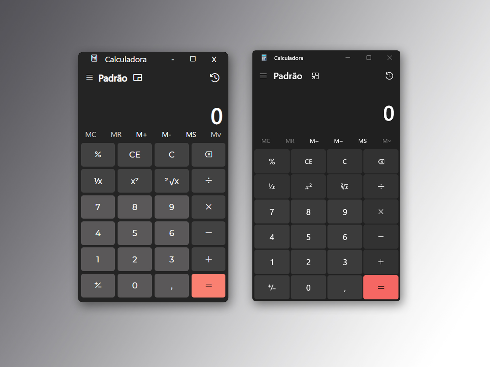

<h1 align="center"> Calculadora Windows 11 (Clone) </h1>

Calculadora simples para cálculos simples.

  <a href="#-tecnologias">Tecnologias</a>&nbsp;&nbsp;&nbsp;|&nbsp;&nbsp;&nbsp;
  <a href="#-projeto">Projeto</a>&nbsp;&nbsp;&nbsp;|&nbsp;&nbsp;&nbsp;
  <a href="#-layout">Layout</a>&nbsp;&nbsp;&nbsp;|&nbsp;&nbsp;&nbsp;
  <a href="#memo-licença">Licença</a>

  

 

  

## 🚀 Tecnologias

Esse projeto foi desenvolvido com as seguintes tecnologias:

- HTML e CSS
- JavaScript
- Git e GitHub

## 💻 Projeto

A Calculadora foi desenvoldida para testar meus conhecimentos em HTML/CSS e JavaScript. Para desenvolver este projeto também utilizei o ChatGPT como fontes de pesquisa, para que certas funcionalidades dessem certo, como a atualização do Display com pontos de milhar, já que na minha lógica o .toLocaleString() não estava funcionando, entre outras features menores. 

Acesse o projeto neste Link: <a href="https://w11calc.devmateus.tech/" target="_blank">Calculadora</a>

## 🔖 Layout

Você pode visualizar o layout do projeto através do seu próprio Windows, foi totalmente baseado no aplicativo padrão como mostra a imagem da capa.

## :memo: Licença

Esse projeto está sob a licença MIT.

---

Feito com ♥ by Mateus Santos.